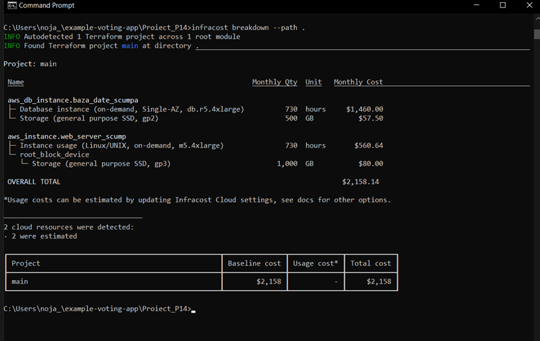
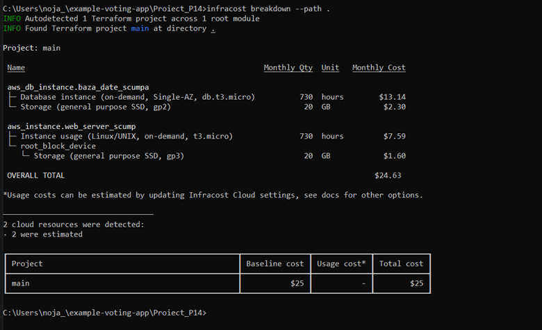

# DevOps & Cloud Project - Theme P14: Cloud cost analysis and right-sizing

## Project Overview
This project was focused on implementing the core concepts of Cloud Financial Management and resource optimization via Right-sizing techniques.

**Main Objective:** To analyze an over-provisioned cloud infrastructure (simulated in AWS) and implement two concrete cost-saving measures without affecting the core functionality of the development/testing environment.

### 📂 Repository Structure & Code Versions
For grading purposes, both versions of the infrastructure code have been preserved in this repository:
* `main.tf` -> Contains the final, optimized infrastructure code (cost reduced to $25/month).
* `expensive_infrastructure.tf` -> Contains the initial, over-provisioned code (~$2158/month) for direct comparison.
* `images/` -> Contains local terminal screenshots of the generated cost reports.

## The Initial Scenario: Resource Waste (Over-Provisioning)
It is a common pitfall for development teams to spin up oversized resources due to a lack of monitoring or standard guidelines. In this scenario, I started with an AWS infrastructure defined via Terraform that included:

1. **EC2 Server (`m5.4xlarge`)**: A massive virtual machine with 16 vCPUs and 64 GB RAM, paired with an oversized 1 TB gp3 EBS storage volume.
2. **RDS Database (`db.r5.4xlarge`)**: A high-end, Memory-Optimized Postgres instance running on 500 GB gp2 storage.

I ran the **Infracost** tool locally to perform a static cost breakdown of this configuration. The initial baseline estimate came out to a massive **$2,158.14 per month**.

## Implemented Cost-Saving Measures (Right-Sizing)
To fix this budget leak, I applied two clear right-sizing optimization strategies directly into the Terraform manifests:

### Measure 1: Compute Optimization (EC2 Right-Sizing)
* **Instance Downgrade:** Changed the virtual server instance type from `m5.4xlarge` to `t3.micro` (2 vCPUs, 1 GB RAM). This specification is more than enough for a standard dev/test environment.
* **Storage Reduction:** Downsized the root EBS block volume from **1 TB** to **20 GB**, which easily accommodates the Linux OS and test application code.

### Measure 2: Database Optimization (RDS Right-Sizing)
* **Database Class Downgrade:** Moved the Postgres database from the expensive `db.r5.4xlarge` tier to a cost-effective `db.t3.micro`.
* **Storage Allocation Adjustment:** Reduced the allocated database storage from **500 GB** down to **20 GB**, eliminating unutilized space that was being billed for no reason.

## Results (Quantifying Savings)
After updating the `.tf` files, I re-ran `infracost breakdown --path .` on the optimized code directory.

* **Initial Monthly Cost (Over-Provisioned):** $2,158.14 / month
* **New Monthly Cost (Optimized):** ~$25.00 / month
* **Monthly Savings:** **$2,133.14**
* **Projected Annual Savings:** **$25,597.68**
* **Total Cost Reduction:** **~98.8% decrease**

Below is the terminal screenshot confirming the new optimized monthly run rate of $25:

## How to Run the Project Locally

### Prerequisites:
* Terraform CLI installed
* Infracost CLI installed and configured (`infracost auth register`)

### Verification Commands:
cd Proiect_P14

# Run the static cost breakdown on the current manifest
infracost breakdown --path .